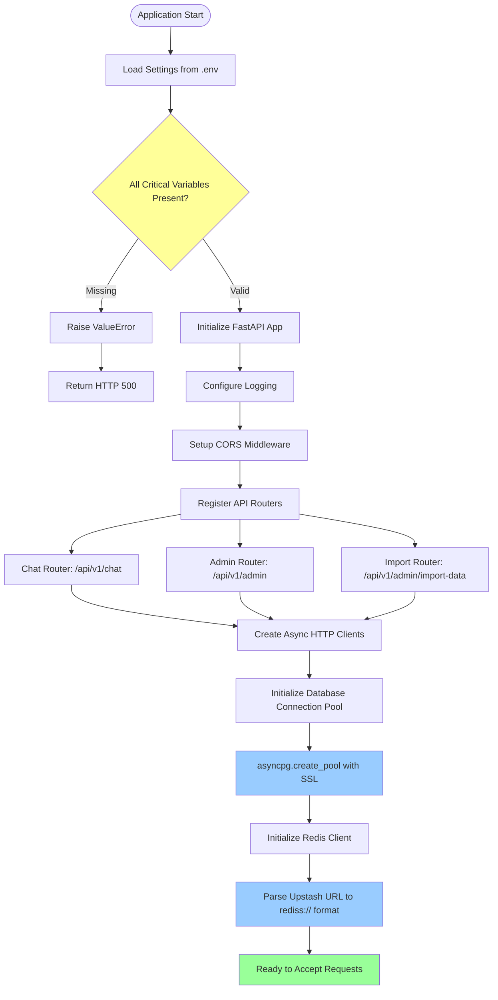
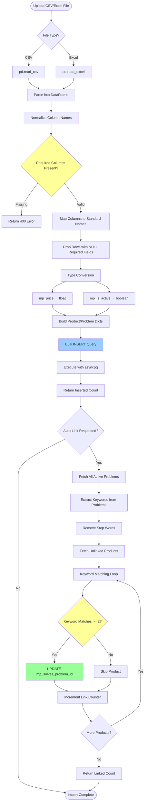
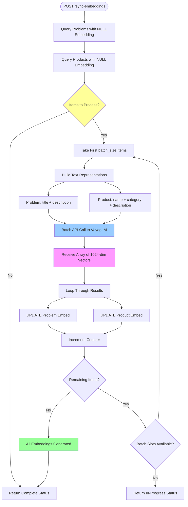
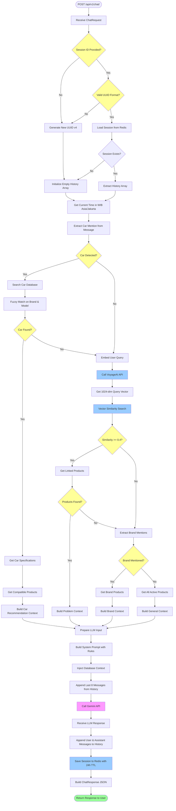
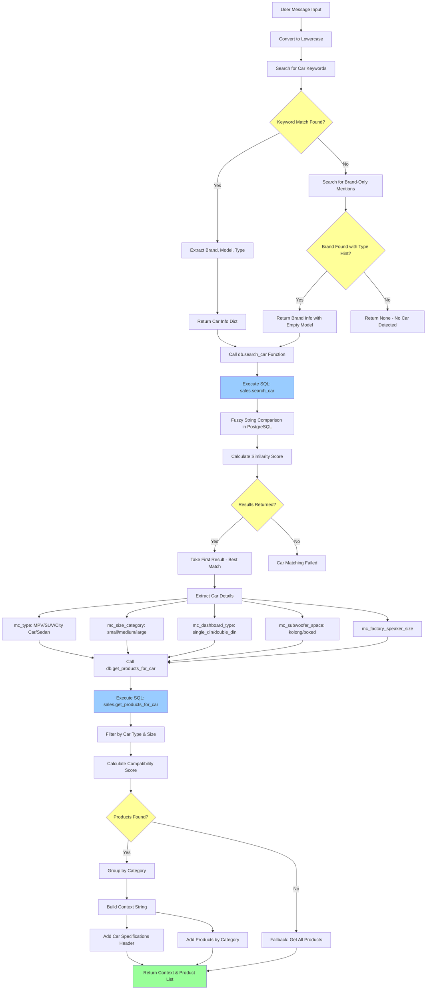

# AudioMatch API - Comprehensive Flowchart & Process Documentation

## 📋 Table of Contents
1. [Complete System Flowchart](#complete-system-flowchart)
2. [Application Initialization Flow](#1-application-initialization-flow)
3. [Data Import & Management Flow](#2-data-import--management-flow)
4. [Embedding Synchronization Flow](#3-embedding-synchronization-flow)
5. [Main Chat Process Flow](#4-main-chat-process-flow)
6. [Car Detection & Matching Flow](#5-car-detection--matching-flow)
7. [Vector Search & Problem Matching Flow](#6-vector-search--problem-matching-flow)
8. [Brand & General Fallback Flow](#7-brand--general-fallback-flow)
9. [LLM Response Generation Flow](#8-llm-response-generation-flow)
10. [Session Management Flow](#9-session-management-flow)

---

## Complete System Flowchart

```mermaid
graph TB
    Start([System Start]) --> Init[Application Initialization]
    
    subgraph INITIALIZATION["🔧 APPLICATION INITIALIZATION"]
        Init --> LoadConfig[Load Environment Variables]
        LoadConfig --> ValidateConfig{Critical Config Valid?}
        ValidateConfig -->|No| ConfigError[Return 500 Error]
        ValidateConfig -->|Yes| InitServices[Initialize Services]
        InitServices --> InitDB[PostgreSQL Connection Pool]
        InitServices --> InitRedis[Upstash Redis Client]
        InitServices --> InitEmbedding[VoyageAI HTTP Client]
        InitServices --> InitLLM[Gemini HTTP Client]
        InitDB --> SetupCORS[Configure CORS Middleware]
        InitRedis --> SetupCORS
        InitEmbedding --> SetupCORS
        InitLLM --> SetupCORS
        SetupCORS --> RegisterRoutes[Register API Routes]
        RegisterRoutes --> Ready[Server Ready]
    end
    
    Ready --> DataImport{"Data Import<br/>Required?"}
    Ready --> EmbedSync{"Embedding Sync<br/>Required?"}
    Ready --> ChatRequest([User Chat Request])
    
    subgraph DATA_IMPORT["📥 DATA IMPORT & MANAGEMENT"]
        DataImport -->|Yes| UploadFile[Upload CSV/Excel File]
        UploadFile --> DetectFormat{Detect File Format}
        DetectFormat -->|CSV| ParseCSV[Parse with pandas.read_csv]
        DetectFormat -->|Excel| ParseExcel[Parse with pandas.read_excel]
        ParseCSV --> ValidateColumns{Required Columns Present?}
        ParseExcel --> ValidateColumns
        ValidateColumns -->|No| ValidationError[Return 400 Validation Error]
        ValidateColumns -->|Yes| MapColumns[Map Column Names to Standard Format]
        MapColumns --> CleanData[Clean & Transform Data]
        CleanData --> TypeConvert[Type Conversion & Validation]
        TypeConvert --> InsertDB[Bulk INSERT into Database]
        InsertDB --> AutoLink{Auto-Link Products?}
        AutoLink -->|Yes| KeywordMatch[Keyword Matching Algorithm]
        KeywordMatch --> LinkProducts[UPDATE mp_solves_problem_id FK]
        LinkProducts --> ImportSuccess[Return Success Response]
        AutoLink -->|No| ImportSuccess
        InsertDB --> ImportSuccess
        ImportSuccess --> DataImportEnd([Data Imported Successfully])
    end
    
    subgraph EMBEDDING_SYNC["🔄 EMBEDDING SYNCHRONIZATION"]
        EmbedSync -->|Yes| QueryUnembedded[Query Items with NULL Embeddings]
        QueryUnembedded --> GetProblems[Get Unembedded Problems]
        QueryUnembedded --> GetProducts[Get Unembedded Products]
        GetProblems --> BatchTexts[Create Text Representations]
        GetProducts --> BatchTexts
        BatchTexts --> VoyageAPI[Call VoyageAI API]
        VoyageAPI --> GetEmbeddings[Receive 1024-dim Vectors]
        GetEmbeddings --> UpdateProblemEmb[UPDATE problem embeddings]
        GetEmbeddings --> UpdateProductEmb[UPDATE product embeddings]
        UpdateProblemEmb --> CheckRemaining{All Items Embedded?}
        UpdateProductEmb --> CheckRemaining
        CheckRemaining -->|No| NextBatch[Process Next Batch]
        NextBatch --> QueryUnembedded
        CheckRemaining -->|Yes| EmbedComplete[All Embeddings Generated]
        EmbedComplete --> EmbedSyncEnd([Embeddings Synchronized])
    end
    
    subgraph MAIN_CHAT["💬 MAIN CHAT PROCESS"]
        ChatRequest --> ReceiveReq[POST /api/v1/chat/]
        ReceiveReq --> ValidateSession{Session ID Valid?}
        ValidateSession -->|No| NewSession[Generate New UUID]
        ValidateSession -->|Yes| LoadSession[Load Session from Redis]
        NewSession --> InitHistory[Initialize Empty History]
        LoadSession --> GetHistory[Get Conversation History]
        InitHistory --> GetCurrentTime[Get Current Time WIB]
        GetHistory --> GetCurrentTime
        GetCurrentTime --> DetectCar[Extract Car Mention from Message]
    end
    
    subgraph CAR_DETECTION["🚗 CAR DETECTION & MATCHING"]
        DetectCar --> CarFound{Car Detected?}
        CarFound -->|Yes| SearchCarDB[Call sales.search_car Function]
        SearchCarDB --> FuzzyMatch[Fuzzy String Matching]
        FuzzyMatch --> GetCarInfo[Retrieve Car Specifications]
        GetCarInfo --> GetCarProducts[Get Car-Compatible Products]
        GetCarProducts --> FilterCompatible[Filter by Car Type & Size]
        FilterCompatible --> GroupByCategory[Group Products by Category]
        GroupByCategory --> BuildCarContext[Build Recommendation Context]
        BuildCarContext --> CarContextReady[Car Context Prepared]
        CarFound -->|No| SkipCar[Skip Car Processing]
        SkipCar --> VectorSearch
    end
    
    subgraph VECTOR_SEARCH["🔍 VECTOR SEARCH & PROBLEM MATCHING"]
        CarContextReady --> EmbedQuery[Embed User Query via VoyageAI]
        SkipCar --> EmbedQuery
        EmbedQuery --> QueryVector1024[1024-Dimension Vector]
        QueryVector1024 --> SearchProblems[Call sales.search_problem Function]
        SearchProblems --> CosineSimilarity[Cosine Similarity Calculation]
        CosineSimilarity --> FilterThreshold{Similarity >= 0.4?}
        FilterThreshold -->|Yes| GetTop3[Get Top 3 Matches]
        FilterThreshold -->|No| BrandFallback
        GetTop3 --> GetFirstProblem[Take Best Match]
        GetFirstProblem --> GetLinkedProducts[Get Products via FK Relationship]
        GetLinkedProducts --> HasProducts{Products Found?}
        HasProducts -->|Yes| SortByTier[Sort by Brand Tier & Price]
        SortByTier --> GroupByCat[Group by Category]
        GroupByCat --> BuildProblemContext[Build Problem Context]
        BuildProblemContext --> ProblemContextReady[Problem Context Prepared]
        HasProducts -->|No| BrandFallback
    end
    
    subgraph BRAND_FALLBACK["🏷️ BRAND & GENERAL FALLBACK"]
        ProblemContextReady --> CheckRecs{Recommendations Found?}
        BrandFallback --> ExtractBrands[Extract Brand Mentions]
        ExtractBrands --> HasBrand{Brand Mentioned?}
        HasBrand -->|Yes| GetBrandProducts[Get Products by Brand]
        GetBrandProducts --> BuildBrandContext[Build Brand Context]
        BuildBrandContext --> BrandContextReady[Brand Context Prepared]
        HasBrand -->|No| GetAllProducts[Get All Active Products]
        GetAllProducts --> BuildGeneralContext[Build General Context]
        BuildGeneralContext --> GeneralContextReady[General Context Prepared]
        CheckRecs -->|Yes| PrepareLLM
        CheckRecs -->|No| BrandFallback
        BrandContextReady --> PrepareLLM
        GeneralContextReady --> PrepareLLM
    end
    
    subgraph LLM_GENERATION["🤖 LLM RESPONSE GENERATION"]
        CarContextReady --> BuildPrompt[Build System Prompt]
        ProblemContextReady --> BuildPrompt
        BrandContextReady --> BuildPrompt
        GeneralContextReady --> BuildPrompt
        BuildPrompt --> InjectContext[Inject Database Context]
        InjectContext --> AddRules[Add Critical Rules]
        AddRules --> AddHistory[Add Conversation History]
        AddHistory --> FormatMessages[Format Messages for Gemini]
        FormatMessages --> CallGemini[Call Gemini API]
        CallGemini --> GetResponse[Receive LLM Response]
        GetResponse --> ValidateResponse{Response Valid?}
        ValidateResponse -->|No| Retry[Retry with Exponential Backoff]
        Retry --> CallGemini
        ValidateResponse -->|Yes| AppendHistory[Append to Conversation History]
        AppendHistory --> SaveRedis[Save Session to Redis]
        SaveRedis --> BuildResponse[Build ChatResponse Object]
        BuildResponse --> ReturnResponse[Return JSON Response]
        ReturnResponse --> ChatEnd([Response Sent to User])
    end
    
    PrepareLLM --> BuildPrompt
    CarContextReady -.-> LLM_GENERATION
    ProblemContextReady -.-> LLM_GENERATION
    BrandContextReady -.-> LLM_GENERATION
    GeneralContextReady -.-> LLM_GENERATION
```



---

## 1. Application Initialization Flow



---

## 2. Data Import & Management Flow



---

## 3. Embedding Synchronization Flow



---

## 4. Main Chat Process Flow



---

## 5. Car Detection & Matching Flow



---

## 6. Vector Search & Problem Matching Flow

```mermaid
graph TB
    A[User Query Text] --> B[Call embedding_service.get_embedding]
    B --> C[Build VoyageAI API Payload]
    C --> D[input_type: query]
    C --> E[model: voyage-3.5-lite]
    D --> F[POST to api.voyageai.com/v1/embeddings]
    E --> F
    F --> G{HTTP Status?}
    G -->|Error| H[Retry with Exponential Backoff]
    H --> F
    G -->|200 OK| I[Parse Response JSON]
    I --> J[Extract embedding Array]
    J --> K[1024-Dimensional Vector]
    
    K --> L[Call db.search_problem]
    L --> M[Execute SQL: sales.search_problem]
    M --> N[Cosine Similarity Calculation]
    N --> O[Compare with All Problem Embeddings]
    O --> P{Similarity >= 0.4 Threshold?}
    
    P -->|Yes| Q[Sort by Similarity DESC]
    P -->|No| R[No Problems Matched]
    
    Q --> S[Return Top 3 Results]
    S --> T[Take First Result - Best Match]
    T --> U[Extract Problem Details]
    U --> V[mcp_id, mcp_problem_title]
    U --> W[mcp_recommended_approach]
    
    V --> X[Call db.get_recommendations]
    W --> X
    
    X --> Y[SELECT Products WHERE mp_solves_problem_id = mcp_id]
    Y --> Z[JOIN master_customer_problems]
    Z --> AA[Filter: mp_is_active = TRUE]
    AA --> AB[Sort by Brand Tier Priority]
    AB --> AC[Tier 1: JL Audio, Rockford, Hertz]
    AB --> AD[Tier 2: Pioneer, Kenwood, JVC]
    AB --> AE[Tier 3: Budget Brands]
    AC --> AF[Within Tier: Sort by Price DESC]
    AD --> AF
    AE --> AF
    
    AF --> AG[Return Product List]
    AG --> AH{Products Found?}
    
    AH -->|Yes| AI[Build Products Array]
    AH -->|No| AJ[Return to Fallback Logic]
    
    AI --> AK[Group Products by Category]
    AK --> AL[Assign Option Numbers]
    AL --> AM[Build Context String]
    AM --> AN[Add Problem Title & Approach]
    AM --> AO[Add Products by Category]
    AN --> AP[Return Context & Recommendations]
    AO --> AP
    
    style G fill:#ff9
    style P fill:#ff9
    style AH fill:#ff9
    style F fill:#9cf
    style M fill:#9cf
    style AP fill:#9f9
    style AJ fill:#f99
```



---

## 7. Brand & General Fallback Flow

```mermaid
graph TB
    A[No Problem Matched] --> B[Convert Query to Lowercase]
    B --> C[Define Known Brands List]
    C --> D[Search for Brand Keywords in Query]
    D --> E{Brand Mentioned?}
    
    E -->|Yes| F[Extract All Mentioned Brands]
    E -->|No| G[No Brand Detected]
    
    F --> H[Loop Through Each Brand]
    H --> I[Call db.get_products_by_brand]
    I --> J[SELECT WHERE LOWER(mp_brand) = brand]
    J --> K[Filter: mp_is_active = TRUE]
    K --> L[Sort by Price DESC]
    L --> M[Return Brand Products]
    M --> N[Add to all_products_context]
    N --> O{More Brands?}
    O -->|Yes| H
    O -->|No| P[Build Brand Context String]
    
    G --> Q[Call db.get_all_active_products]
    Q --> R[SELECT WHERE mp_is_active = TRUE]
    R --> S[Sort by Category, Price ASC]
    S --> T[Return All Products]
    T --> U[Add to all_products_context]
    U --> V[Build General Context String]
    
    P --> W[Group Products by Category]
    V --> W
    W --> X[Format Context for LLM]
    X --> Y[Add Category Headers]
    X --> Z[Add Product Details]
    Y --> AA[Build RecommendedSolution Object]
    Z --> AA
    
    AA --> AB[Return to LLM Preparation]
    
    style E fill:#ff9
    style J fill:#9cf
    style R fill:#9cf
    style AA fill:#9f9
```

---

## 8. LLM Response Generation Flow

```mermaid
graph TB
    A[Context Ready] --> B[Get Current Time WIB]
    B --> C[Build System Prompt Template]
    C --> D[Add Critical Rules]
    D --> E[MUST NOT hallucinate products]
    D --> F[MUST use only database context]
    D --> G[MUST include pricing Rp format]
    D --> H[MUST follow Markdown formatting]
    
    E --> I[Add Car-Specific Rules]
    F --> I
    G --> I
    H --> I
    
    I --> J[City Car: compact solutions]
    I --> K[MPV: full system possible]
    I --> L[SUV: premium setups]
    I --> M[Sedan: sound quality focus]
    
    J --> N[Add Budget Tier Rules]
    K --> N
    L --> N
    M --> N
    
    N --> O[High Budget >10jt: premium brands]
    N --> P[Medium Budget 5-10jt: mid-range]
    N --> Q[Low Budget <5jt: budget brands]
    
    O --> R[Inject Database Context]
    P --> R
    Q --> R
    R --> S[Context to Inject]
    
    S --> T[Build Messages Array]
    T --> U[System Message: system_prompt]
    T --> V[History: last 8 messages]
    T --> W[Current User Message]
    
    U --> X[Format for Gemini API]
    V --> X
    W --> X
    
    X --> Y[Convert to Gemini Native Format]
    Y --> Z[Separate system_instruction]
    Y --> AA[Build contents array]
    Z --> AB[Create Payload]
    AA --> AB
    
    AB --> AC[Add generationConfig]
    AC --> AD[maxOutputTokens: 8192]
    AC --> AE[temperature: 0.1]
    AD --> AF[POST to Gemini API]
    AE --> AF
    AF --> AG[generativelanguage.googleapis.com]
    
    AG --> AH{HTTP Status?}
    AH -->|429 Rate Limit| AI[Retry after 2s]
    AH -->|5xx Server Error| AI
    AH -->|200 OK| AJ[Parse Response JSON]
    AI --> AF
    AJ --> AK[Extract candidates[0].content.parts[0].text]
    AK --> AL[LLM Response Text]
    
    AL --> AM[Append User Message to History]
    AL --> AN[Append Assistant Message to History]
    AM --> AO[Save Session to Redis]
    AN --> AO
    
    AO --> AP[SET session:{session_id}]
    AP --> AQ[TTL: 86400 seconds 24 hours]
    AQ --> AR[Build ChatResponse Object]
    AR --> AS[Add session_id]
    AR --> AT[Add response text]
    AR --> AU[Add recommendations array]
    AS --> AV[Return JSON to Client]
    AT --> AV
    AU --> AV
    
    AV --> AW([Response Delivered])
    
    style AH fill:#ff9
    style AF fill:#f9f
    style AK fill:#9f9
    style AO fill:#9cf
    style AV fill:#9f9
```

---

## 9. Session Management Flow

```mermaid
graph TB
    A[New Chat Request] --> B{Session ID in Request?}
    B -->|No| C[Generate UUID v4]
    B -->|Yes| D{Valid UUID Format?}
    D -->|No| C
    D -->|Yes| E[GET session:{session_id} from Redis]
    C --> F[SET session:{new_id} with empty history]
    F --> G[Initialize history = []]
    E --> H{Session Data Exists?}
    H -->|No| F
    H -->|Yes| I[Parse JSON to Dict]
    I --> J[Extract history array]
    J --> K[Get Last 8 Messages]
    K --> L[Add to LLM Context]
    
    G --> M[Process Chat]
    L --> M
    M --> N[Receive LLM Response]
    N --> O[Append User Message to history]
    N --> P[Append Assistant Message to history]
    
    O --> Q[Serialize to JSON]
    P --> Q
    Q --> R[SET session:{id} in Redis]
    R --> S[EX 86400 24-hour TTL]
    S --> T[Session Saved]
    
    T --> U([Next Request Can Load Session])
    
    style B fill:#ff9
    style D fill:#ff9
    style H fill:#ff9
    style F fill:#9cf
    style R fill:#9cf
    style T fill:#9f9
```

---

## 📚 Professional Explanation

### 1. Application Initialization Flow

**Deskripsi Teknis:**

Proses inisialisasi aplikasi AudioMatch API mengikuti arsitektur berbasis **FastAPI framework** dengan pendekatan **dependency injection** dan **connection pooling**. Pada tahap startup, sistem melakukan loading konfigurasi environment variables melalui class `Settings` yang mengextend `pydantic_settings.BaseSettings`. Pattern ini memungkinkan validasi tipe data secara otomatis melalui Pydantic type hints dan field constraints.

Setelah konfigurasi ter-load, sistem melakukan validasi terhadap critical variables yang meliputi `DATABASE_URL`, `VOYAGE_API_KEY`, `GEMINI_API_KEY`, dan credentials untuk Upstash Redis. Apabila terdapat variable yang missing, sistem akan raise `ValueError` yang subsequently caught oleh root endpoint handler dan mengembalikan HTTP 500 response dengan error details.

Database connection pool diinisialisasi menggunakan library `asyncpg` dengan metode `create_pool()` yang menggunakan SSL/TLS encryption untuk koneksi ke Neon PostgreSQL server. Pool dikonfigurasi dengan `min_size=1` dan `max_size=40` untuk mengoptimalkan resource utilization pada environment serverless Vercel. Redis client initialization melibatkan URL transformation dari Upstash REST URL format (`https://`) menjadi Redis protocol format (`rediss://`) dengan proper authentication token injection.

HTTP clients untuk VoyageAI dan Gemini diinisialisasi sebagai global singleton instances dengan timeout configuration dan retry logic yang dihandle oleh library `tenacity`.

---

### 2. Data Import & Management Flow

**Deskripsi Teknis:**

Data import functionality dirancang untuk mendukung ingestion data produk dan customer problems dari file CSV maupun Excel melalui endpoint `POST /api/v1/admin/import-data/*`. Proses parsing memanfaatkan library `pandas` dengan conditional logic untuk mendeteksi file format berdasarkan ekstensi file (`.csv` → `pd.read_csv()`, `.xlsx`/`.xls` → `pd.read_excel()`).

Setelah file ter-parse menjadi DataFrame, sistem melakukan column normalization melalui whitespace stripping dan case-insensitive matching terhadap predefined column mapping dictionaries. Mapping ini memungkinkan fleksibilitas dalam penamaan kolom pada file sumber (misalnya kolom "name" akan otomatis ter-map ke `mp_name`).

Validation phase memastikan required columns hadir dalam DataFrame. Untuk products, required columns meliputi `mp_name`, `mp_category`, dan `mp_price`. Untuk problems, required column hanya `mcp_problem_title`. Rows yang missing required values akan di-drop menggunakan pandas `dropna()` method.

Type conversion phase mengonversi `mp_price` ke numeric float dan `mp_is_active` ke boolean melalui custom parser yang mendukung berbagai format boolean representation (`"true"`, `"1"`, `"yes"`, `"y"`, `"t"`).

Bulk insertion dilakukan melalui multi-row INSERT query yang dibangun secara dinamis berdasarkan jumlah rows. Parameter binding menggunakan positional parameters (`$1`, `$2`, dst.) untuk mencegah SQL injection.

Auto-linking functionality mengimplementasikan keyword matching algorithm untuk establish relasi antara products dan problems. Algorithm ini melakukan tokenization pada problem titles dan descriptions, stopword removal, dan kemudian menghitung keyword overlap dengan product text. Produk akan ter-link ke problem apabila terdapat minimal 2 keyword matches.

---

### 3. Embedding Synchronization Flow

**Deskripsi Teknis:**

Embedding synchronization berfungsi untuk meng-generate vector embeddings (1024 dimensions) bagi records yang belum ter-embed di database. Proses ini critical untuk enabling vector similarity search pada customer problems dan products.

Sistem meng-query `master_customer_problems` dan `master_products` dengan filter `WHERE embedding IS NULL`. Records yang ter-returned kemudian diproses dalam batches yang ukurannya dikontrol oleh `batch_size` query parameter (default: 20).

Text representation untuk each record dibentuk melalui concatenation: problems menggunakan format `"{title}: {description}"` dan products menggunakan format `"{name} ({category}): {description}"`.

Batch embedding dilakukan melalui single API call ke VoyageAI dengan payload berisi array of texts. Pendekatan batch ini mengoptimasi API usage karena VoyageAI free tier memiliki rate limit 3 RPM (requests per minute).

Embedding vectors yang di-return kemudian di-update ke database melalui individual UPDATE queries. Sistem melakukan tracking terhadap processed count dan remaining count untuk memberikan feedback apakah pemanggilan endpoint perlu diulangi.

---

### 4. Main Chat Process Flow

**Deskripsi Teknis:**

Chat endpoint merupakan core business logic dari AudioMatch API. Endpoint ini mengimplementasikan multi-strategy approach untuk matching user queries dengan product recommendations.

**Session Management:** Sistem menggunakan UUID v4 untuk session identification. Session data (conversation history) disimpan di Redis dengan key format `session:{session_id}` dan TTL 24 jam (86400 seconds). Pattern ini memungkinkan stateless API design sementara maintaining conversation context.

**Car Detection:** `_extract_car_mention()` function melakukan keyword-based matching terhadap hardcoded dictionary yang memetakan 50+ car models ke brand, model name, dan type information. Detection logic dilakukan dalam dua tier: specific model detection terlebih dahulu, kemudian brand-only detection apabila tidak ada model yang matched.

**Vector Search:** Apabila tidak ada car yang ter-detected, sistem melakukan embedding terhadap user query menggunakan VoyageAI dan executing vector similarity search melalui PostgreSQL function `sales.search_problem()`. Function ini mengimplementasikan cosine similarity calculation dengan threshold 0.4 dan return top 3 matches.

**Recommendation Retrieval:** Matched problem digunakan untuk retrieve linked products melalui foreign key relationship `mp_solves_problem_id`. Products di-sort berdasarkan brand tier priority (premium brands first) dan price descending.

**Fallback Strategies:** Apabila tidak ada problem yang matched (similarity < 0.4), sistem melakukan brand mention extraction. Jika brand ter-detected, products untuk brand tersebut di-return. Apabila tidak ada brand yang mentioned, semua active products di-return sebagai general fallback.

---

### 5. Car Detection & Matching Flow

**Deskripsi Teknis:**

Car detection mechanism mengimplementasikan dictionary-based keyword extraction dengan two-tier matching strategy. Dictionary mendefinisikan mapping dari lowercase keywords ke tuple `(brand, model, type)`.

Tier pertama melakukan exact substring matching untuk specific car models (e.g., "xpander", "brio", "fortuner"). Apabila match ditemukan, function immediately return dengan car information dictionary.

Tier kedua handle brand-only mentions dengan additional requirement adanya type keyword (MPV, SUV, sedan, dll) dalam message. Brand-only matching return brand dengan empty model field, yang subsequently digunakan dalam database query untuk retrieve all models dari brand tersebut.

Database car search menggunakan PostgreSQL function `sales.search_car()` yang mengimplementasikan fuzzy string matching. Function ini calculate similarity score antara input dan stored car records, return records yang melebihi similarity threshold.

Setelah car ter-match, sistem retrieve car specifications dari `master_cars` table termasuk type, size category, dashboard type, subwoofer space, dan factory speaker specifications. Specifications ini digunakan untuk filter compatible products melalui `sales.get_products_for_car()` function.

---

### 6. Vector Search & Problem Matching Flow

**Deskripsi Teknis:**

Vector search pipeline mengimplementasikan dense retrieval methodology menggunakan neural embeddings dari VoyageAI model `voyage-3.5-lite`.

**Embedding Generation:** User query text di-convert menjadi 1024-dimensional vector melalui VoyageAI API. Embedding process menggunakan `input_type="query"` parameter yang mengoptimasi vector untuk retrieval tasks. Retry logic dengan exponential backoff diimplementasikan untuk handle transient API failures.

**Similarity Search:** Query vector digunakan dalam PostgreSQL function `sales.search_problem()` yang melakukan cosine similarity calculation terhadap semua problem embeddings dalam `master_customer_problems` table. Cosine similarity formula: `similarity = 1 - cosine_distance(query_vector, problem_vector)`. Threshold 0.4 berarti hanya problems dengan similarity score ≥ 0.4 yang considered matches.

**Product Retrieval:** Matched problem's `mcp_id` digunakan untuk retrieve associated products melalui foreign key join. Query melakukan JOIN antara `master_products` dan `master_customer_problems` dengan filter `mp_is_active = TRUE` dan `mcp_is_active = TRUE`.

**Sorting Strategy:** Products di-sort menggunakan composite strategy: pertama berdasarkan brand tier (premium brands priority 1, mid-range priority 2, budget priority 3), kemudian berdasarkan price descending within each tier. Strategy ini memastikan premium products ter-expose terlebih dahulu kepada user.

---

### 7. Brand & General Fallback Flow

**Deskripsi Teknis:**

Fallback mechanism diaktifkan ketika vector similarity search tidak berhasil menemukan matching problems (semua similarity scores < 0.4).

**Brand Extraction:** Sistem melakukan substring matching terhadap predefined list known brands. Matching dilakukan pada lowercase version of user query untuk case-insensitive comparison. Multiple brand mentions dalam single query di-support dan semua mentioned brands akan di-process.

**Brand Product Retrieval:** Untuk each mentioned brand, sistem execute query `sales.get_products_by_brand()` yang retrieve semua active products dari brand tersebut, sorted by price descending. Products ditambahkan ke `all_products_context` accumulator dan formatted untuk LLM consumption.

**General Fallback:** Apabila tidak ada brand yang mentioned, sistem retrieve semua active products melalui `sales.get_all_active_products()`. Products di-sort by category dan price ascending untuk memberikan organized view dari available inventory.

**Context Building:** Products di-group by category dan formatted dengan category headers, product names, prices, dan descriptions. Context string ini kemudian di-inject ke LLM system prompt sebagai reference database.

---

### 8. LLM Response Generation Flow

**Deskripsi Teknis:**

LLM interaction menggunakan Google Gemini API melalui native REST endpoint (bukan OpenAI-compatible wrapper). System prompt construction mengikuti template-based approach dengan dynamic context injection.

**System Prompt Architecture:** Prompt terdiri dari beberapa sections: (1) Identity & role definition ("AudioMatch Expert"), (2) Critical rules yang enforce factual responses berdasarkan database context only, (3) Car-specific recommendation guidelines yang vary berdasarkan car type dan size, (4) Budget tier guidance untuk product prioritization, (5) Brand positioning information, (6) Response formatting rules menggunakan Markdown syntax, (7) Injected database context yang berisi actual product recommendations.

**Message Formatting:** OpenAI-format messages array di-convert ke Gemini native format. System message di-extract menjadi `system_instruction` field. User dan assistant messages di-convert menjadi `contents` array dengan role "user" atau "model" dan text content dalam `parts` array.

**API Interaction:** POST request dilakukan ke `generativelanguage.googleapis.com/v1beta/models/{model}:generateContent` endpoint. Payload mencakup `contents`, `system_instruction`, dan `generationConfig` (maxOutputTokens: 8192, temperature: 0.1).

**Retry Logic:** tenacity library menghandle retry dengan exponential backoff (multiplier=1, min=2s, max=10s) untuk HTTP 429 (rate limit) dan 5xx (server error) responses.

**Session Persistence:** Setelah response diterima, user message dan assistant response di-append ke conversation history array. Session data di-save ke Redis dengan 24-hour TTL untuk mempertahankan conversation context across requests.

---

### 9. Session Management Flow

**Deskripsi Teknis:**

Session management mengimplementasikan stateless conversation tracking menggunakan Redis sebagai external state store. Pattern ini essential untuk serverless deployment di Vercel dimana function instances bersifat ephemeral dan stateless.

**Session Creation:** Apabila request tidak include valid session_id, sistem generate UUID v4 dan initialize session dengan empty history array. Session di-create di Redis pada first request.

**Session Loading:** Valid session_id digunakan untuk GET session data dari Redis dengan key `session:{session_id}`. Apabila session tidak exist (expired atau invalid ID), sistem treat sebagai new session.

**History Truncation:** Conversation history yang di-load dari Redis di-truncate ke last 8 messages untuk LLM context window management. Strategy ini balance antara maintaining conversation context dan limiting token usage dalam API calls.

**Session Update:** Setelah LLM response di-generate, sistem append user message dan assistant response ke history array, kemudian SET session data ke Redis dengan TTL 86400 seconds (24 hours). TTL ini memastikan sessions expire secara otomatis untuk menghemat Redis storage.

**Serialization:** Session data di-serialize ke JSON format menggunakan Python's `json.dumps()` dan di-deserialize menggunakan `json.loads()`. Data structure merupakan dictionary dengan key `history` yang map ke array of message objects.

---
---

## 🧒 Penjelasan Sederhana (Untuk Anak SD)

### 1. Aplikasi Mulai (Initialization)

**Bayangkan seperti ini:**

Anggap kamu punya **toko audio mobil** yang sangat canggih. Sebelum toko buka, kamu harus menyiapkan beberapa hal dulu:

1. **Buku catatan besar** (Database PostgreSQL) → tempat kamu tulis semua produk dan masalah pelanggan
2. **Kotak penyimpanan percakapan** (Redis) → tempat kamu simpan obrolan dengan pembeli
3. **Kamus penerjemah** (VoyageAI) → alat yang bisa mengubah kata-kata menjadi "angka ajaib" supaya komputer bisa paham
4. **Asisten pintar** (Gemini AI) → robot yang bisa jawab pertanyaan pembeli

Jadi, **saat aplikasi dinyalakan**, dia checking dulu: "Apakah semua alat sudah siap?" Kalau ada yang kurang, dia bilang: "Waduh, saya belum bisa buka toko!" Tapi kalau semua sudah siap, dia bilang: "Oke, toko sudah buka! Silakan belanja!" 🏪

---

### 2. Memasukkan Data (Data Import)

**Bayangkan seperti ini:**

Kamu punya **daftar produk baru** di kertas (file CSV atau Excel). Kamu mau masukkan semua produk ini ke buku catatan besarmu (database).

Caranya:
1. Kamu **serahkan kertasnya** ke asisten (upload file)
2. Asisten **baca kertasnya** dulu: "Oh ini format CSV" atau "Oh ini format Excel"
3. Asisten **periksa** dulu: "Apakah ada nama produk? Ada harga? Ada kategori?" Kalau tidak ada, dia bilang: "Waduh, kertasnya tidak lengkap!"
4. Kalau lengkap, asisten **rapihin** dulu datanya: "Harga harus angka", "Status harus aktif atau tidak aktif"
5. Lalu asisten **menulis semua produk** ke buku catatan besarmu (database)

**Fitur canggihnya:** Ada tombol "auto-link" yang otomatis **menghubungkan produk dengan masalah** yang biasa dialami pelanggan. Misalnya: produk "Subwoofer" otomatis dikaitkan dengan masalah "Bass kurang kencang". Ini pakai cara **mencocokkan kata-kata yang mirip**. 🔗

---

### 3. Membuat "Vektor Ajaib" (Embedding Sync)

**Bayangkan seperti ini:**

Setiap produk dan masalah punya **"sidik jari"** yang unik. Sidik jari ini bentuknya adalah **deretan 1024 angka** yang disebut "vektor" atau "embedding".

Kenapa butuh sidik jari? Supaya nanti kalau ada pelanggan datang dan bilang "Saya mau bass yang kuat", komputer bisa **cepat menemukan** masalah dan produk yang paling cocok!

Prosesnya:
1. Komputer **periksa** dulu: "Produk atau masalah mana yang belum punya sidik jari?"
2. Untuk yang belum punya, komputer **kirim teksnya** ke "pabrik sidik jari" (VoyageAI)
3. Pabrik **buatkan sidik jari** (vektor 1024 angka)
4. Komputer **simpan** sidik jari itu ke buku catatan

Proses ini dilakukan **bertahap** (batch), misalnya 20 per sekali, supaya tidak "capek" (hemat kuota API). Kamu bisa **ulangi prosesnya** sampai semua punya sidik jari! 🖐️

---

### 4. Proses Ngobrol dengan Pembeli (Main Chat)

**Ini yang paling seru!**

Bayangkan kamu punya **pelayan toko super pintar**. Begini cara dia bekerja saat pelanggan datang:

**Langkah 1: "Siapa kamu?"**
- Pelayan periksa: "Apakah kamu sudah pernah ke sini sebelumnya?" (check session_id)
- Kalau sudah pernah, pelayan **ingat obrolan kalian** kemarin (load history dari Redis)
- Kalau belum pernah, pelayan **kenalin diri** dulu dan kasih nomor pelanggan baru (generate UUID)

**Langkah 2: "Mobil apa yang kamu punya?"**
- Pelayan dengarkan apa yang pelanggan bilang
- Kalau pelanggan sebut **nama mobil** (misalnya "Xpander", "Brio"), pelayan **langsung catat** mobilnya apa
- Pelayan buka **buku spec mobil** untuk tahu: "Oh Xpander itu mobil besar (MPV), bagasinya luas, head unitnya double DIN"

**Langkah 3: "Masalah apa yang kamu alami?"**
- Kalau pelanggan bilang "Bass mobil saya kurang keras", pelayan pakai **kamus penerjemah** (VoyageAI) untuk mengubah kalimat itu jadi "sidik jari"
- Terus pelayan **bandingkan sidik jari** itu dengan semua "sidik jari masalah" yang ada di buku catatan
- Kalau ketemu yang mirip (di atas 40% mirip), pelayan bilang: "Oh, masalah kamu ini ya! Ini produk yang cocok..."

**Langkah 4: "Kalau tidak cocok?"**
- Kalau tidak ada masalah yang cocok, pelayan cek: "Apakah kamu sebut **merk tertentu**? Misalnya Kenwood, Pioneer?"
- Kalau iya, pelayan **tunjukkan semua produk** merk itu
- Kalau tidak sebut merk juga, pelayan **tunjukkan semua produk** yang ada di toko

**Langkah 5: "Robot pintar menjawab"**
- Pelayan kumpulkan semua info yang dia dapat
- Terus info itu **dikirim ke robot pintar** (Gemini AI)
- Robot pintar **buat jawaban yang bagus** dan sopan
- Jawaban itu **dikembalikan ke pelanggan**
- Dan obrolannya **disimpan** supaya kalau besok pelanggan datang lagi, pelayan masih ingat! 🤖

---

### 5. Mendeteksi Mobil (Car Detection)

**Bayangkan seperti ini:**

Pelayan toko punya **daftar 50+ jenis mobil** yang hafal di luar kepala! Daftar ini mencakup:
- MPV: Xpander, Avanza, Xenia, Ertiga...
- City Car: Brio, Agya, Ayla...
- SUV: Fortuner, Pajero, CR-V...
- Sedan: Civic, Camry, Corolla...

**Cara kerjanya:**
1. Pelanggan bilang: "Saya punya **Xpander**, mau upgrade audio"
2. Pelayan **dengar kata "Xpander"** dan langsung ingat: "Oh! Mitsubishi Xpander, mobil MPV yang besar!"
3. Pelayan buka **kartu spec Xpander**:
   - Tipe: MPV (mobil keluarga besar)
   - Kabin: Medium (cukup luas)
   - Dashboard: Double DIN (head unit besar)
   - Subwoofer: Bisa pakai yang kotak besar (bagasi luas)
   - Speaker bawaan: 6.5 inch

4. Terus pelayan **cari produk** yang cocok buat Xpander:
   - Head Unit Android yang double DIN ✅
   - Speaker component 6.5 inch ✅
   - Subwoofer 12 inch boxed ✅
   - Amplifier 4 channel ✅

**Kalau pelanggan cuma sebut merk:** "Saya punya **Honda**..."
- Pelayan tanya dalam hati: "Honda apa ya?"
- Kalau pelanggan tambahin "City Car" atau "SUV", pelayan bisa tebak
- Kalau tidak, pelayan **tunjukkan semua mobil Honda** yang ada di daftar 🚗

---

### 6. Mencari Masalah dengan "Sidik Jari" (Vector Search)

**Ini yang paling canggih!**

Bayangkan kamu punya **15 kartu masalah**. Setiap kartu punya "sidik jari" yang unik:
- Kartu 1: "Bass kurang kencang" → [0.12, 0.45, 0.78, ... 1024 angka]
- Kartu 2: "Speaker depan rusak" → [0.34, 0.56, 0.12, ... 1024 angka]
- Kartu 3: "Mau upgrade sound system" → [0.67, 0.23, 0.89, ... 1024 angka]

**Cara kerjanya:**
1. Pelanggan bilang: "Bass mobil saya **lemah banget**"
2. Kalimat itu **diterjemahkan** jadi sidik jari: [0.15, 0.43, 0.81, ... 1024 angka]
3. Komputer **bandingkan** sidik jari ini dengan semua kartu masalah:
   - Kartu 1: "Bass kurang kencang" → **90% mirip!** ✅
   - Kartu 2: "Speaker depan rusak" → 30% mirip ❌
   - Kartu 3: "Mau upgrade sound system" → 45% mirip ❌

4. Karena Kartu 1 **paling mirip (90%)**, komputer pilih itu!
5. Terus komputer lihat: "Masalah 'Bass kurang kencang' ini **produk apa yang cocok**?"
6. Ketemu: Subwoofer JL Audio, Amplifier Rockford Fosgate, dll.
7. Produk-produk ini **ditampilkan** ke pelanggan! 🎯

**Kemirannya diukur dari 0% sampai 100%.** Kalau di bawah 40%, dianggap "tidak mirip" dan cari cara lain.

---

### 7. Cara Cadangan (Fallback)

**Bayangkan seperti ini:**

Kadang, pertanyaan pelanggan **tidak cocok** dengan masalah apapun yang ada di buku. Misalnya pelanggan bilang: "Mau lihat produk **Kenwood** dong!"

Nah, pelayan punya **rencana cadangan**:

**Rencana A: Cek Merk**
- Pelayan dengerin baik-baik: "Apakah kamu sebut merk tertentu?"
- Kalau pelanggan bilang "Kenwood", "Pioneer", "JVC", dll.
- Pelayan **ambil semua produk** merk itu dari buku
- Terus ditampilkan: "Ini semua produk Kenwood yang kami punya..."

**Rencana B: Tunjukkan Semua**
- Kalau pelanggan **tidak sebut merk** juga, misalnya cuma bilang: "Mau lihat-lihat aja"
- Pelayan **tunjukkan SEMUA produk** yang ada di toko
- Tapi dirapihin dulu berdasarkan kategori: "Ini Head Unit, ini Speaker, ini Subwoofer..."

Jadi pelanggan **tidak pernah pulang** dengan tangan kosong! Selalu ada yang ditawarkan. 🛍️

---

### 8. Robot Pintar Menjawab (LLM Generation)

**Ini bagian paling ajaib!**

Setelah pelayan kumpulkan semua info (produk, masalah, spec mobil), dia **konsultasi dengan robot pintar** (Gemini AI).

**Pelayan kasih instruksi ke robot:**

"Hai robot, ini info yang saya kumpulkan:
- Masalah pelanggan: Bass kurang kencang
- Produk yang cocok: Subwoofer JL Audio, Amplifier Rockford
- Mobil pelanggan: Xpander (MPV, bagasi luas)

**Aturan menjawab:**
1. JANGAN karang-karang produk yang tidak ada!
2. PAKAI HARGA dalam format 'Rp 1.500.000'
3. JELASKAN kenapa produk ini cocok untuk Xpander
4. PAKAI bahasa yang sopan dan rapi
5. TULIS dengan format yang mudah dibaca (pakai nomor, huruf tebal, dll)

Silakan buat jawaban yang bagus!"

**Robot pintar mikir** sebentar (biasanya 2-5 detik)...

**Robot jawab:**

"### Sistem Audio untuk Mitsubishi Xpander

Berdasarkan kebutuhan Anda untuk meningkatkan bass pada Mitsubishi Xpander, berikut rekomendasi lengkapnya:

**1. Subwoofer JL Audio 12W3v3-4 - Rp 4.500.000**
   Subwoofer 12 inch dengan kualitas premium. Sangat cocok untuk bagasi Xpander yang luas!"

**Setelah robot selesai jawab:**
- Pelayan **simpan obrolan ini** di kotak penyimpanan (Redis)
- Besok kalau pelanggan datang lagi, pelayan **masih ingat** obrolan kemarin
- Obrolan disimpan selama **24 jam**, setelah itu dihapus otomatis supaya kotaknya tidak penuh! 🧠

---

### 9. Mengingat Obrolan (Session Management)

**Bayangkan seperti ini:**

Setiap pelanggan punya **box khusus** di gudang penyimpanan (Redis). Box ini punya **nomor unik** (session_id) misalnya: `abc-123-def-456`.

**Cara kerjanya:**

**Pertemuan pertama:**
- Pelanggan datang: "Hai, saya mau tanya-tanya..."
- Pelayan: "Oh halo! Ini nomor pelanggan Anda: `abc-123-def-456`. Simpan baik-baik ya!"
- Pelayan **buat box baru** dan tulis obrolan pertama di dalamnya
- Pelayan **set timer 24 jam**: "Box ini akan hilang besok kalau tidak dipakai"

**Pertemuan kedua:**
- Pelanggan datang lagi: "Hai, saya kemarin sudah tanya tentang subwoofer. Ada yang lebih murah?"
- Pelayan: "Oh iya! Saya ingat kamu kemarin" (pakai nomor `abc-123-def-456`)
- Pelayan **buka box-nya**, baca obrolan kemarin
- Pelayan bisa jawab: "Kemarin kamu lihat Subwoofer JL Audio Rp 4.5 juta. Nah ini ada alternatif DHD Rp 2.5 juta..."

**Setelah 24 jam:**
- Box **otomatis hilang** dari gudang
- Kalau pelanggan datang lagi, pelayan tidak ingat
- Pelanggan dianggap **pelanggan baru** lagi

Kenapa ada batas 24 jam? Supaya gudangnya **tidak penuh** dengan box-box lama yang sudah tidak dipakai! 📦

---

## 🎓 Kesimpulan

### Versi Profesional:

AudioMatch API mengimplementasikan **arsitektur microservices-based sales chatbot** dengan pendekatan **hybrid retrieval system** yang menggabungkan:
1. **Dictionary-based car detection** untuk contextual recommendations
2. **Dense vector retrieval** menggunakan neural embeddings (VoyageAI) untuk semantic problem matching
3. **Lexical fallback mechanisms** untuk brand-based dan general product discovery
4. **LLM-powered response generation** (Google Gemini) dengan constrained prompting untuk memastikan factual accuracy
5. **Externalized session management** (Redis) untuk stateless serverless deployment

Sistem ini dirancang untuk **scalability** (connection pooling, batch processing, rate limiting), **maintainability** (clean architecture, dependency injection, service layer pattern), dan **user experience** (conversation memory, contextual recommendations, multi-strategy retrieval).

---

### Versi Sederhana:

AudioMatch itu seperti punya **pelayan toko super pintar** yang bisa:
1. 🧠 **Ingat** pelanggan yang pernah datang sebelumnya
2. 🚗 **Kenali** mobil apa yang pelanggan punya
3. 🔍 **Pahami** masalah yang pelanggan alami (meski dijelaskan dengan bahasa berbeda)
4. 📦 **Rekomendasikan** produk yang paling cocok
5. 💬 **Menjawab** dengan sopan dan jelas

Semua ini dilakukan **otomatis** oleh komputer, jadi pelanggan bisa dapat rekomendasi produk audio yang tepat **kapan saja**, tanpa harus tunggu sales buka toko! 🎉
