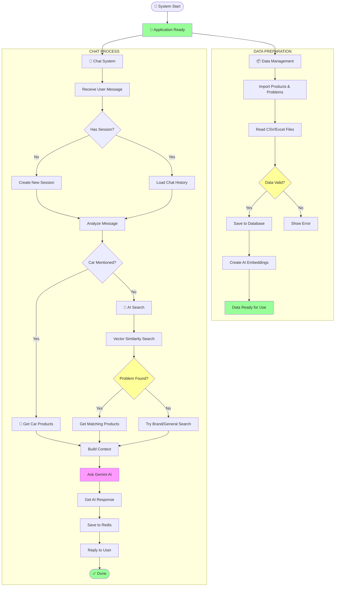
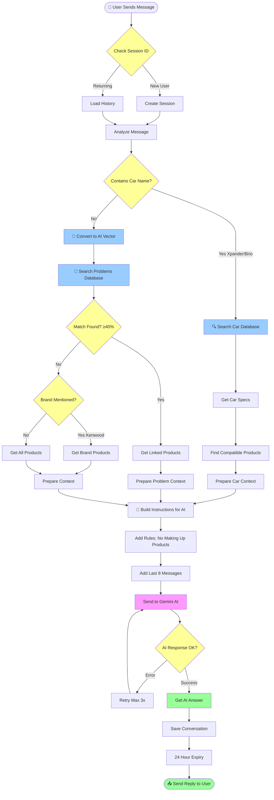
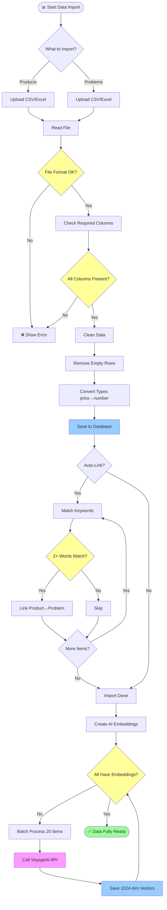

# AudioMatch API - Simplified Flowchart & Overview

## 📋 Table of Contents
1. [System Overview Flowchart](#system-overview-flowchart)
2. [Main Chat Process Flowchart](#main-chat-process-flowchart)
3. [Data Management Flowchart](#data-management-flowchart)
4. [Professional Explanation](#-professional-explanation)
5. [Simple Explanation (For Beginners)](#-simple-explanation-for-beginners)

---

## System Overview Flowchart



---

## Main Chat Process Flowchart



---

## Data Management Flowchart



---

## 🎓 Professional Explanation

### 1. System Architecture Overview

AudioMatch API adalah **AI-powered sales chatbot** yang dirancang untuk membantu pelanggan toko audio mobil (Rendy Audio) menemukan produk yang tepat berdasarkan masalah atau kebutuhan mereka. Sistem ini mengimplementasikan **hybrid retrieval approach** yang menggabungkan tiga strategi pencarian:

- **Car-based retrieval**: Mendeteksi mention mobil dan merekomendasikan produk yang kompatibel
- **Vector-based semantic search**: Menggunakan neural embeddings untuk mencocokkan masalah user dengan masalah yang ada di database
- **Lexical fallback**: Brand-based dan general product search sebagai backup

Sistem dibangun menggunakan **FastAPI** (Python) dengan arsitektur **service layer pattern**, menggunakan **PostgreSQL dengan pgvector** untuk vector search, **VoyageAI** untuk embeddings, **Google Gemini** untuk LLM, dan **Upstash Redis** untuk session management.

---

### 2. Main Chat Process

Chat endpoint (`POST /api/v1/chat/`) merupakan core workflow yang mengimplementasikan **multi-strategy recommendation engine**:

**Session Management**: Sistem menggunakan UUID-based session identification dengan conversation history yang disimpan di Redis (24-hour TTL). Pattern ini memungkinkan **stateless design** yang cocok untuk serverless deployment di Vercel.

**Car Detection Layer**: Sistem melakukan keyword-based extraction untuk mendeteksi mention dari 50+ car models. Jika car terdetected, sistem retrieve car specifications (type, size, dashboard type, subwoofer space) dan filter compatible products.

**Vector Search Layer**: Jika tidak ada car yang mentioned, user query di-embed menggunakan VoyageAI (1024 dimensions) dan dibandingkan dengan problem embeddings menggunakan cosine similarity. Threshold 0.4 menentukan apakah match considered valid. Top 3 matches returned, dan products yang linked ke best-matched problem di-retrieve.

**Fallback Layer**: Jika similarity < 0.4 (tidak ada problem matched), sistem extract brand mentions. Jika brand mentioned (e.g., "Kenwood"), products untuk brand tersebut di-retrieve. Jika tidak, semua active products di-return sebagai general fallback.

**LLM Generation**: Context yang terkumpul (car specs / problem + products / brand products / all products) di-inject ke system prompt bersama rules dan conversation history (last 8 messages). Prompt di-send ke Gemini API untuk generate response. Retry logic dengan exponential backoff handle API failures.

**Session Persistence**: Setelah response received, conversation di-save ke Redis dengan TTL 86400s (24 hours) untuk maintain context across requests.

---

### 3. Data Management Pipeline

Data import functionality mendukung ingestion dari CSV/Excel files untuk **products** dan **customer problems**. Parsing menggunakan `pandas` dengan automatic format detection, column normalization (flexible column name mapping), type validation (price→float, active→boolean), dan bulk insertion.

**Auto-linking Feature**: Keyword matching algorithm otomatis establish relasi antara products dan problems. Algorithm tokenize problem titles/descriptions, remove stopwords, dan hitung keyword overlap dengan product text. Minimum 2 keyword matches required untuk establish link.

**Embedding Synchronization**: Semua records (problems dan products) membutuhkan vector embeddings untuk enabling vector search. Sistem batch-process records yang embedding-nya masih NULL, mengirim texts ke VoyageAI API, dan save returned 1024-dim vectors. Batch size configurable (default 20) untuk optimize API usage mengingat rate limits.

---

### 4. Vector Search & Semantic Matching

Vector search merupakan **core retrieval mechanism** yang memungkinkan semantic understanding dari user queries. VoyageAI model `voyage-3.5-lite` meng-encode text menjadi dense vectors yang capture semantic meaning.

**Embedding Generation**: User query di-encode dengan `input_type="query"` parameter. API call menggunakan retry logic (tenacity) dengan exponential backoff untuk handle transient failures.

**Similarity Calculation**: PostgreSQL function `sales.search_problem()` melakukan cosine similarity calculation antara query vector dan semua problem embeddings. Formula: `similarity = 1 - cosine_distance(query_vector, problem_vector)`. Threshold 0.4 berarti hanya problems dengan similarity ≥ 40% yang considered matches.

**Product Retrieval**: Matched problem's ID digunakan untuk retrieve linked products via foreign key (`mp_solves_problem_id`). Products di-sort menggunakan composite strategy: brand tier priority (premium first) kemudian price descending within tier. Strategy ini memastikan high-value products ter-expose terlebih dahulu.

---

### 5. LLM Integration & Response Generation

LLM interaction menggunakan **Google Gemini API** (native REST endpoint, bukan OpenAI wrapper). System prompt construction mengikuti template-based approach dengan dynamic context injection.

**System Prompt Design**: Prompt terdiri dari identity definition, critical rules (no hallucination, database-only recommendations), car-specific guidelines (vary by car type/size), budget tier rules (high/medium/low budget → different brand priorities), formatting rules (Markdown), dan injected database context.

**Message Formatting**: Messages array di-convert ke Gemini native format. System message menjadi `system_instruction` field. User/assistant messages menjadi `contents` array dengan role "user"/"model".

**Response Handling**: POST request ke `generativelanguage.googleapis.com` endpoint. Payload includes `contents`, `system_instruction`, dan `generationConfig` (maxOutputTokens: 8192, temperature: 0.1 for deterministic responses). Retry logic handle 429 (rate limit) dan 5xx (server errors).

---

## 🧒 Simple Explanation (For Beginners)

### 1. Apa Itu AudioMatch?

AudioMatch itu seperti punya **asisten penjualan super pintar** untuk toko audio mobil. Asisten ini bisa:

- 🧠 **Ingat** pelanggan yang pernah chat sebelumnya
- 🚗 **Kenali** mobil apa yang pelanggan punya
- 🔍 **Pahami** masalah yang pelanggan alami (meski dijelasin dengan bahasa beda)
- 📦 **Rekomendasikan** produk yang paling cocok
- 💬 **Menjawab** dengan sopan dan jelas

Jadi pelanggan bisa dapat rekomendasi produk yang tepat **kapan saja**, tanpa harus tunggu toko buka! 🎉

---

### 2. Bagaimana Chat Bekerja?

Bayangkan kamu punya **pelayan toko cerdas**. Begini cara dia kerja:

**Langkah 1: "Apakah kamu sudah pernah ke sini?"**
- Kalau sudah pernah, pelayan **ingat obrolan kemarin** (load history)
- Kalau belum, pelayan **kenalin diri** dan kasih nomor pelanggan baru

**Langkah 2: "Mobil apa yang kamu punya?"**
- Kalau pelanggan sebut nama mobil (misalnya "Xpander"), pelayan langsung cek spec mobil itu
- Kalau tidak sebut mobil, pelayan lanjut ke langkah lain

**Langkah 3: "Masalah apa yang kamu alami?"**
- Pelayan pakai **AI canggih** untuk pahamin masalah pelanggan
- Contoh: Pelanggan bilang "Bass kurang keras" → Pelayan paham ini masalah "bass lemah"
- Pelayan cari produk yang cocok: Subwoofer, Amplifier, dll.

**Langkah 4: "Kalau tidak ketemu?"**
- Kalau masalah tidak cocok, pelayan cek: "Apakah kamu sebut merk? Kenwood? Pioneer?"
- Kalau iya, tunjukkan semua produk merk itu
- Kalau tidak, tunjukkan SEMUA produk yang ada

**Langkah 5: "Robot pintar menjawab"**
- Semua info yang terkumpul dikirim ke **robot pintar** (Gemini AI)
- Robot bikin jawaban yang bagus, sopan, dan jelas
- Jawaban dikirim ke pelanggan
- Obrolan disimpan supaya besok masih ingat! 🤖

---

### 3. Bagaimana Data Dikelola?

**Memasukkan Produk Baru:**

Bayangkan kamu punya **daftar produk** di kertas (file CSV/Excel):

1. Kamu **serahkan kertasnya** ke komputer
2. Komputer **baca dan periksa**: "Apakah ada nama produk? Ada harga?"
3. Kalau lengkap, komputer **tulis semua** ke buku catatan besar (database)
4. Ada tombol "auto-link" yang otomatis **menghubungkan produk dengan masalah**:
   - Produk "Subwoofer" → Masalah "Bass kurang kencang"
   - Produk "Head Unit Android" → Masalah "Mau upgrade sound system"

**Membuat "Sidik Jari AI":**

Setiap produk dan masalah punya **"sidik jari"** unik yang bentuknya 1024 angka:

1. Komputer periksa: "Siapa yang belum punya sidik jari?"
2. Kirim teks ke "pabrik sidik jari" (VoyageAI)
3. Pabrik buatkan sidik jari (vektor)
4. Simpan ke database

Sidik jari ini gunanya supaya nanti komputer bisa **cepat mencocokkan** masalah pelanggan dengan yang ada di database! 🔍

---

### 4. Bagaimana AI Mencari yang Cocok?

**Contoh Kasus:**

Pelanggan bilang: *"Bass mobil saya lemah banget"*

**Yang terjadi di balik layar:**

1. **Ubah jadi angka**: Kalimat itu diubah jadi 1024 angka (sidik jari)
2. **Bandingkan**: Sidik jari ini dibandingkan dengan semua masalah di database:
   - "Bass kurang kencang" → **90% mirip!** ✅
   - "Speaker rusak" → 30% mirip ❌
   - "Mau upgrade" → 45% mirip ❌
3. **Pilih yang cocok**: Yang 90% dipilih!
4. **Cari produk**: Masalah "Bass kurang kencang" punya produk apa?
   - Subwoofer JL Audio
   - Amplifier Rockford Fosgate
   - Subwoofer Pioneer
5. **Tampilkan**: Produk-produk ini ditunjukkan ke pelanggan!

**Kemirinan diukur 0-100%.** Di bawah 40% dianggap "tidak mirip" dan pakai cara lain (cek merk atau tampilkan semua).

---

### 5. Bagaimana Sistem Mengingat Obrolan?

Setiap pelanggan punya **"box khusus"** di gudang (Redis):

**Pertemuan Pertama:**
- Pelanggan: "Hai, saya mau tanya-tanya..."
- Komputer: "Ini nomor Anda: `abc-123-def`. Simpan ya!"
- Komputer **buat box baru** dan tulis obrolan di dalamnya
- Set **timer 24 jam** → box akan hilang besok

**Pertemuan Kedua:**
- Pelanggan: "Kemarin saya tanya subwoofer. Ada yang lebih murah?"
- Komputer buka box-nya (pakai nomor `abc-123-def`)
- Komputer: "Oh iya! Kemarin kamu lihat JL Audio Rp 4.5 juta. Nah ini ada DHD Rp 2.5 juta..."

**Setelah 24 Jam:**
- Box **hilang otomatis**
- Kalau pelanggan datang lagi, komputer tidak ingat
- Pelanggan dianggap **baru lagi**

Kenapa ada batas 24 jam? Supaya gudang **tidak penuh** dengan box lama! 📦

---

## 🎯 Key Takeaways

### Untuk Developer:
- **Arsitektur**: FastAPI + PostgreSQL (pgvector) + Redis + AI Services
- **Pattern**: Service layer, dependency injection, connection pooling
- **Retrieval**: Hybrid approach (car detection + vector search + fallback)
- **Deployment**: Serverless-ready (Vercel), stateless design

### Untuk Non-Technical:
- **Input**: Pelanggan chat → sistem paham masalahnya
- **Proses**: AI cari produk yang paling cocok
- **Output**: Rekomendasi produk + penjelasan yang jelas
- **Memory**: Sistem ingat obrolan selama 24 jam

---

## 📊 System Components Summary

| Component | Technology | Purpose |
|-----------|-----------|---------|
| **Backend** | FastAPI (Python) | Web framework |
| **Database** | PostgreSQL 17 + pgvector | Store products, problems, cars + vector search |
| **Embeddings** | VoyageAI (voyage-3.5-lite) | Convert text to 1024-dim vectors |
| **LLM** | Google Gemini (gemini-1.5-flash) | Generate responses |
| **Cache/Session** | Upstash Redis | Store conversation history |
| **Deployment** | Vercel (serverless) | Host the API |

---

## 🚀 Quick Start Example

```bash
# 1. Set environment variables
export DATABASE_URL="postgresql://..."
export VOYAGE_API_KEY="..."
export GEMINI_API_KEY="..."
export UPSTASH_REDIS_REST_URL="..."
export UPSTASH_REDIS_REST_TOKEN="..."

# 2. Run the application
uvicorn app.main:app --reload

# 3. Import data (products & problems)
curl -X POST http://localhost:8000/api/v1/admin/import-data/products \
  -F "file=@products.csv"

# 4. Generate embeddings
curl -X POST http://localhost:8000/api/v1/admin/sync-embeddings

# 5. Start chatting!
curl -X POST http://localhost:8000/api/v1/chat/ \
  -H "Content-Type: application/json" \
  -d '{"message": "Bass mobil saya kurang kencang, pakai Xpander"}'
```

---

## 💡 Use Cases

✅ **Customer asks about their car**: "Saya punya Xpander, mau upgrade audio"
→ System detect Xpander → Show compatible products

✅ **Customer describes problem**: "Bass kurang keras, pengen yang nendang"
→ Vector search match "Bass kurang kencang" → Show subwoofers & amplifiers

✅ **Customer asks about brand**: "Ada produk Kenwood?"
→ Fallback brand search → Show all Kenwood products

✅ **Customer browsing**: "Mau lihat-lihat aja"
→ General fallback → Show all products organized by category

✅ **Follow-up question**: "Yang opsi 1 lebih bagus dari opsi 2?"
→ Session loaded → AI explain comparison based on context
